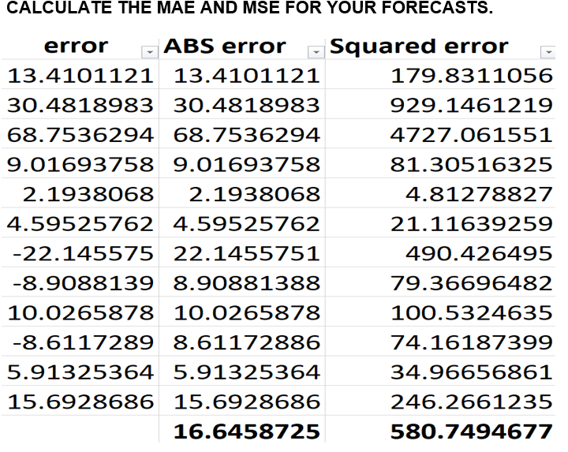

<!DOCTYPE html>
<html lang="en">
<head>
  <meta charset="UTF-8">
  <title>Airline Passengers Time Series Forecasting Project</title>
</head>
<body style="font-family:Segoe UI, Arial, sans-serif; margin:40px; background:#f8f8f8; color:#222;">
  <h1 style="color:#164194;">Time Series Forecasting with Decomposition: US Airline Passengers Dataset</h1>
  
  <h2>Project Overview</h2>
  

    This project applies classical time series decomposition and forecasting methods to monthly airline passenger data for the United States in the 1950s. 
    The objective is to analyze passenger trends and seasonality, build an appropriate forecasting model, and evaluate its predictive accuracy for the year 1960.
  

  
  <h2>Dataset Description</h2>
  <ul>
    <li><b>Source:</b> Public monthly airline passengers data (US, 1949–1960), a standard dataset for time series analysis.</li>
    <li><b>Variables:</b> Month (Jan–Dec), Year (1949–1960), Number of passengers per month.</li>
    <li><b>Sample Size:</b> 144 months (12 years × 12 months).</li>
    <li><b>File Provided:</b> <code>Air-passengersdata.xlsx</code></li>
  </ul>
   
  <b>Figure 1.</b> Monthly Airline Passengers in the US (1949–1959): Clear trend and strong seasonality are visible.

  <h2>Analysis Approach</h2>
  <ul>
    <li>Calculated 12-month moving averages to smooth the trend.</li>
    <li>Computed centered moving averages for seasonal effect estimation.</li>
    <li>Estimated monthly seasonal indices using the ratio-to-moving-average method.</li>
    <li>Deseasonalized the time series and fitted a linear trend to the deseasonalized data.</li>
    <li>Produced monthly forecasts for 1960 and recomposed to the original scale using seasonal indices.</li>
    <li>Evaluated model accuracy using MAE and MSE.</li>
  </ul>
  
   
  <b>Figure 2.</b> Calculation of 12-Month Moving Average, Centered MA, and Seasonal Ratio.
   
  
   
  <b>Figure 3.</b> Monthly Seasonal Indices (multiplicative factors for each month).

  <h2>Trend and Seasonality Detection</h2>
  
  <b>Figure 4.</b> Scatter plot of deseasonalized values and linear trendline (high R²).
  

    The series shows a strong upward trend and pronounced annual seasonality. Multiplicative decomposition is appropriate as seasonal amplitude increases over time.
  

  <h2>Forecasts and Model Performance</h2>
   
  <b>Figure 5.</b> Forecasted passengers for 1960, actuals, and error metrics.
   
  
   
  Mean Absolute Error (MAE) = <b>16.65</b> &nbsp;|&nbsp; Mean Squared Error (MSE) = <b>580.75</b>
  
  <h2>Key Insights & Recommendations</h2>
  <ul>
    <li>Clear upward trend in passengers and strong month-to-month seasonality (especially July–August peaks).</li>
    <li>Multiplicative decomposition is effective for capturing variable seasonal effect.</li>
    <li>Model provides accurate predictions (low MAE/MSE) and can inform resource planning.</li>
    <li>Recommend regular model updates and validation against new actuals.</li>
  </ul>

  <h2>Limitations & Assumptions</h2>
  <ul>
    <li>No adjustment for external events or shocks (e.g., strikes, economic downturns).</li>
    <li>Assumes trend and seasonality continue into the forecast year (1960).</li>
    <li>Model does not detect outliers.</li>
  </ul>
  
  <h2>Conclusion</h2>
  

    Classical time series decomposition with a multiplicative approach gave accurate and interpretable forecasts for airline passenger numbers. This method is suitable for similar demand forecasting tasks in business analytics, especially where seasonality grows with volume.
  

</body>
</html>
